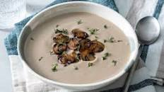

# README File

### recipe

DS-Tool box **Pratice** .

Recipe of cream of *mushroom soup* .

The practice has gone through
1. Create, pull, commit, push to git
2. Conflict and merge changes
3. Branches and etc.

    